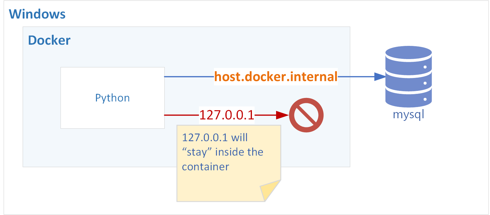

**&larr; [Back to Project 2 README](../README.md)**

# Introduction

This section contents that may be useful to your project:

## Creating Project 1 Docker Image

There id an example Dockerfile and _requirements.txt_ within Project 1 folder if you would like a reference.  Both of these files are needed to create the Docker image.  Please consult with your instructor for more information.  

## Logging into MYSQL

There is already an instant of MYSQL installed on your VM.  To login:

```bash
mysql -h localhost -ppassword

use fca
```
 
where ```use fca``` is the command to switch to a schema calls FCA 
if the FCA schema does not exist, you can use the following command to create it:
```sql
CREATE DATABASE FCA;
```   

## Connecting to MYSQL on Windows from a Docker Container

Any connections to 127.0.0.1 or localhost from within a container will route back to itself (since the container is localhost" as shown below.  You will need to use **host.docker.internal** as database host to connect to the Windows host (see data.py example).

The Project1 model answer will check and use the hostname provided in an environment variable called _**SQL_HOST**_ if it exists otherwise it will fall back to use localhost for the database hose (see data.py).  You will need to pass this environment variable to Project1 container as part of the docker run command

```
-env SQL_HOST='host.docker.internal'
```

.

## Running MYSQL in Docker
If you wish to run MYSQL in a container, using _host.docker.internal_ will not work as MYSQL is running in a separate container and not on the Windows host.  Hence, app cannot see the Mysql DB.  You would need to create a Docker Network to facilitate communication between the two containers.

```
docker network create fca
docker network connect fca project1
docker network connect fca mysql
```

**Note** Container names are used as **HOSTNAME** within a Docker Network

## Problem with Accessing Host Files for Backup from within a Container
A shortcoming that arises from containerizing Project 1 is that the Python application cannot normally see any files that are outside of the container, which makes it pretty useless as a backup util.  One way to address this is to attach host directories as docker volumes which will create docker mount points (e.g. /windows) which allow you to access to the files on the host machine.

see [Volumes - docker official documentation](https://docs.docker.com/storage/volumes/)
